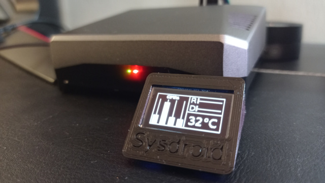
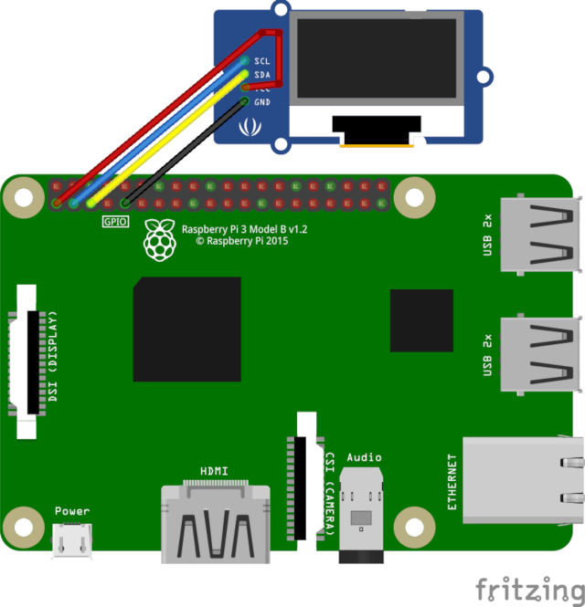
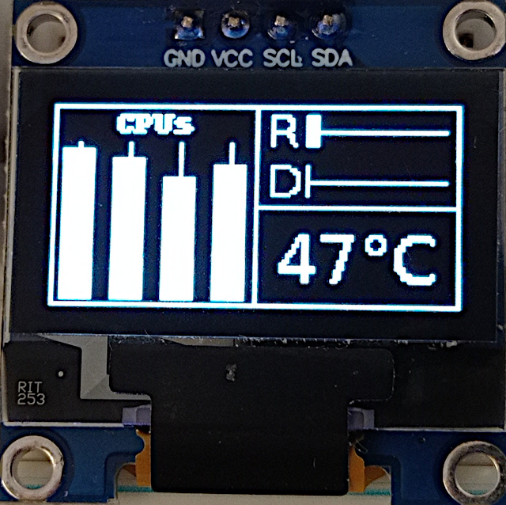
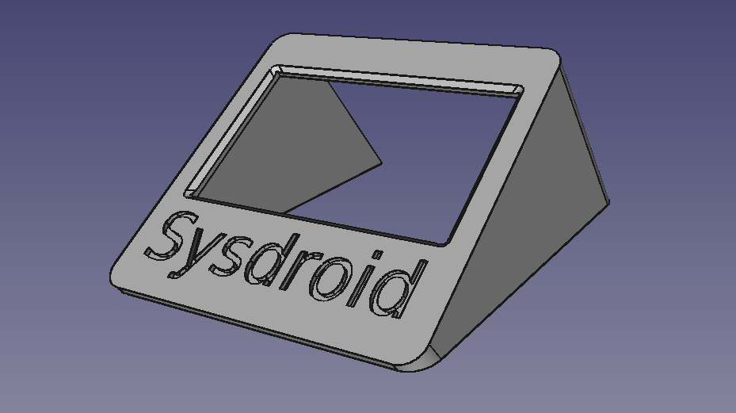

# Sysdroid_OLED

Monitoring temps réel des CPUs, RAM, espace disque et température d'un Rapspberry pi sur un petit écran OLED I2C 128*64 pixels.



## Circuit électronique


vous n'avez besoin que d'un petit écran OLED I2C (4 broches) de 128*64 pixels et d'une nappe de 4 câbles souples femelle/femelles

## préparation du système

### dépendance bibliothèques

l'écran OLED I2C  sera piloté par la bibliothèque d'Adafruit. Elle nécessaire préalablement d'installer [circuitPython](https://learn.adafruit.com/welcome-to-circuitpython/what-is-circuitpython) sur le Raspbery pi (adafruit_blinka). Exécuter le script blinka_test.py avant d'aller plus loin pour être certain d'avoir bien installé la bibliothèque.

Installer ensuite la bilbiotèque [adafruit_circuitpython_ssd1306](https://learn.adafruit.com/monochrome-oled-breakouts/python-setup) ainsi que la PILLOW library.

Activez le bus I2c du raspberry pi (via sudo raspi-config -> 3 Interface Options -> P5 I2C -> OUI). Un reboot sera nécessaire.
Il n'est pas nécessaire de speeder le bus I2C pour ce projet.

Exécuter le script **oled_I2C_test.py** (à récupérer dans le dossier Python de ce Github) pour vous assurez que tout fonctionne.

### script principal
Déposez dans /home/pi le script **sysdroid_oled.py** (à récupérer dans le dossier Python)
Vous pouvez l'exécuter pour vérifier que le monitoring des CPUs, RAM, Disk et température démarre.
* Sur la gauche s'affiche l'état des 4 processeurs sous forme de barres de niveaux verticales
* En haut à droite: il y a le niveau de la RAM puis le niveau de l'espace Disk sous forme de barre de niveaux horizontales
* en bas à droite est indiquée la température des processeurs en °C.
Les données sont mises à jour toutes les 2 secondes



Ce script consomme moins de 1% des capacités du raspberry pi.

### automatisation au démarrage du pi
Pour que le monitoring démarre automatiquement avec le démarrage du raspberry pi, il faut ajouter une commande dans la cron table:

```bach
sudo nano /etc/crontab -e
```

ajouter cette ligne à la fin: 

```bach
@reboot pi python3 'sysdroid_oled.py' &
```

ctrl-O pour enregistrer, puis ctrl-X pour quitter.

Le monitoring va démarrer à chaque reboot du Raspberry.

## cache imprimé 3D

un petit cache optionnel peut être imprimé 3D (18mn en 0.2mm, remplissage 17%).
Le STL est à récupérer dans le dossier STL3D de ce github.



